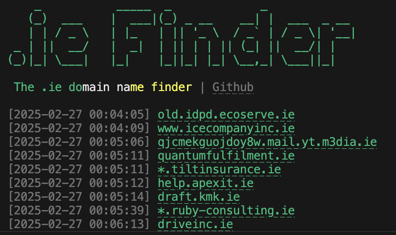

# .ie finder

.ie finder is a python based application that finds and logs `.ie` domain names by checking certificate transparency logs in near real-time.



# How it works

.ie Finder connects to [CertStream](https://certstream.calidog.io/) by Calidog Security, a service that aggregates certificate transparency logs (such as Google's Argon, Cloudflare's Nimbus, etc.) and streams them over a WebSocket. Each time a new certificate is issued, the tool checks whether the domain ends in `.ie` and logs it if so.


## Features

- Logs `.ie` domain names to text files.
- Generates logs in multiple formats: `.txt`, `.csv`.
- Provides verbose output for all tlds (top level domains) passing through using --verbose flag.
- Displays hyperlinks to the found `.ie` domains.

## Requirements

- Python 3.x

# Installation

```bash
$ python3  -m  venv  .venv
$ source  .venv/bin/activate
$ pip  install  -r  requirements.txt
```

  

# Usage
```bash
$ python3 ieFinder.py

    _         _____  _             _             
   (_)  ___  |  ___|(_) _ __    __| |  ___  _ __ 
   | | / _ \ | |_   | || '_ \  / _` | / _ \| '__|
 _ | ||  __/ |  _|  | || | | || (_| ||  __/| |   
(_)|_| \___| |_|    |_||_| |_| \__,_| \___||_|   
                                                 
 The .ie domain name finder | Github

[2025-02-27 00:04:05] old.idpd.ecoserve.ie
[2025-02-27 00:04:09] www.icecompanyinc.ie
[2025-02-27 00:05:06] qjcmekguojdoy8w.mail.yt.m3dia.ie
[2025-02-27 00:05:11] quantumfulfilment.ie
[2025-02-27 00:05:11] *.tiltinsurance.ie
[2025-02-27 00:05:12] help.apexit.ie
[2025-02-27 00:05:14] draft.kmk.ie
[2025-02-27 00:05:39] *.ruby-consulting.ie
[2025-02-27 00:06:13] driveinc.ie
[2025-02-27 00:06:23] www.autoconfig.avalon-house.ie
[2025-02-27 00:06:36] www.autoconfig.avalon-house.ie
[2025-02-27 00:06:37] *.ruby-consulting.ie
...
```


# Output
.ie Finder produces 5 log files in the `logs/` directory:
```
├── certstream.log  certstream library log.
├── log.txt         full domain names including subdomains.
├── domains.txt     cleaned .ie base domain names.
├── domains.csv     timestamped .ie domain names.
└── www.txt         www-prefixed .ie domain names (www.domainName.ie).
```

# Troubleshooting

The default CertStream server (`certstream.calidog.io`) is a free demo instance provided by Calidog Security. It can be unreliable at times, experiencing disconnects or periods where no data is streamed. If ieFinder connects but you see the warning `No data received from CertStream`, the server is likely down or not streaming data.

As an alternative, you can self-host a CertStream server using [certstream-server-go](https://github.com/d-Rickyy-b/certstream-server-go), a drop-in replacement written in Go. It can be run via Docker:

```bash
$ docker run -p 8080:8080 0rickyy0/certstream-server-go
```

Then update the WebSocket URL in `ieFinder.py` to point to your local instance: `wss://localhost:8080/`.

# Attribution
.ie Finder is heavily based on CertSniff by A-poc https://github.com/A-poc/certSniff


